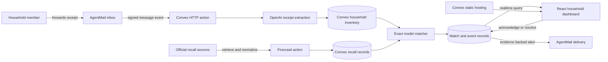

# RecallReady architecture

## Trust boundaries

| Boundary | Enforcement |
| --- | --- |
| Inbound email replay | AgentMail event identifiers are stored behind a unique lookup before processing. |
| Receipt extraction | OpenAI receives receipt text and returns a strict four field JSON schema. |
| Source provenance | Every recall stores the authority, source URL, publication time, retrieval time, and demonstration flag. |
| Match explainability | A match persists its confidence and plain language evidence alongside both record identifiers. |
| External network calls | Firecrawl, OpenAI, and AgentMail run only inside Convex actions. Keys never enter the browser bundle. |
| Webhook access | AgentMail requests require valid, timestamp-bounded Svix HMAC signatures before payload processing. |
| Irreversible state | A household member must explicitly mark a remedy as resolved. The system never hides an open match automatically. |

## Convex data model

- `households` stores the shared protection boundary and configured AgentMail intake address.
- `members` connects a browser session and registered sender email to one household.
- `products` stores exact identifying data and source provenance.
- `recalls` stores official notice evidence.
- `matches` joins products to recalls with confidence and resolution state.
- `events` powers the live audit timeline.
- `sourceRuns` records every Firecrawl attempt and result.
- `inboundEmails` makes AgentMail webhook ingestion idempotent.

## Scale path

Household scoped indexes avoid full table scans for the main product, match, event, and source run views. Source retrieval occurs in actions, while durable state changes remain in mutations. The next production step is fan out through scheduled batches by authority and region, then match the normalized notice once against indexed model signatures rather than crawling per household.
